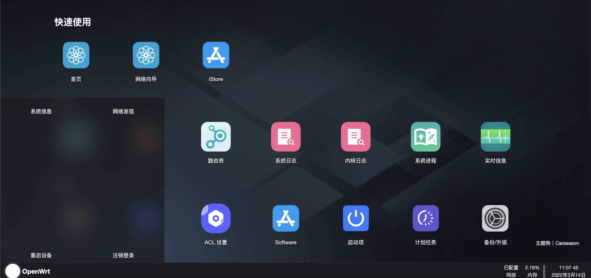
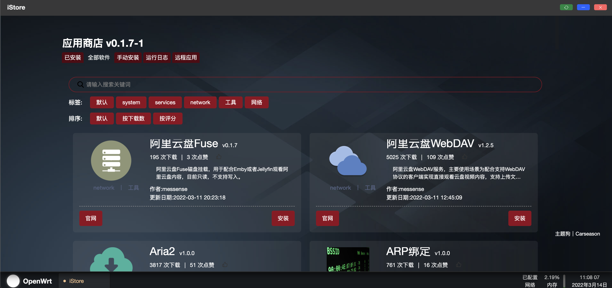
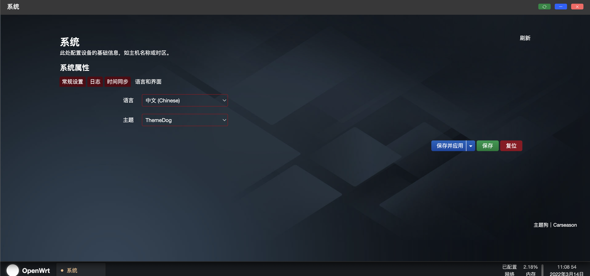

#   openwrt-themedog
    基于 Openwrt21 JavascriptApi 的主题
    前端使用 vue3 Typescript 配合  iframe 实现的可视化主题

##  自定义图标?
    根据 菜单名称 调用图标
        luci/luci-theme-dog/htdocs/luci-static/dog/icons
        app-icon.png 为默认占位图标
    其余的请根据喜好 更换/添加/删除

##  窗口样式不清晰?
    默认使用了 Openwrt21_bootstrap 的 cascade.css 进行了微修改
    对此不满意可替换:
        luci/luci-theme-dog/htdocs/luci-static/themedog/css/cascade.css
    进行更新覆盖

##  背景替换?
    背景可替换:
        luci/luci-theme-dog/htdocs/luci-static/themedog/image/bg.gif
    进行更新覆盖

##  构建:
    make -j16 V=s package/openwrt-themedog/luci/luci-themedog/compile
## 演示:

